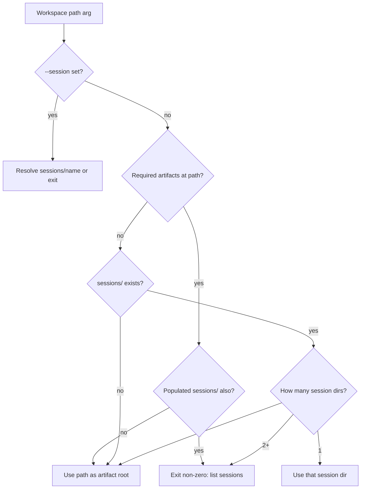

# feat: Major projects contract parity

## Goal Capsule

- **Objective:** Operators and CI reject incomplete Evaluation Briefs that omit Phase 1E/1F decisions, can validate 1E/1F phase raw artifacts the same way as 1D, can export an eval bundle from a session folder without hand-picking paths (except when multiple sessions force an explicit choice), and can install via one clear recommended path with an early “references missing” signal when thin skills cannot resolve templates.
- **Means:** Extend the existing lightweight JSON heading schemas, fixture/CI surface, and `build_eval_bundle.py` discovery helper; tighten README install hierarchy and add a thin references preflight (KTD1–KTD4).
- **Authority:** Product Contract requirements → Planning Contract KTDs → Implementation Units → live `SKILL.md` / audit templates as the section-shape source of truth.
- **Stop when:** U1–U4 each pass their unit Verification commands, then the plan-level Verification Contract (full pytest suite plus manual multi-session checks); parked sim-pack debt for brief 1E/1F is flipped; no silent multi-session bundle selection remains.
- **Out of scope for this goal:** Changing 1E/1F methodology, owning the Phase 1A hater contract, autonomous resume orchestration, redesigning plugin packaging beyond install clarity, aligning `build_eval_bundle` JSON (v1.0) with the hand narrative `future-builders-live` bundle (v1.3), or rejecting hollow 1E/1F decision text beyond existing heading/substring/`forbidden_patterns` dialect.

## Product Contract

### Summary

Close the parked contract lag between Phase 0 (which already requires Security audit / AI durability brief sections) and schema/CI enforcement; add 1E/1F raw schemas; make session-layout workspaces discoverable to the bundle helper; and make install fail loudly when `references/` cannot resolve.

### Problem Frame

Phase 0 templates, ingest, and many fixtures already include 1E/1F brief sections, but `eval-brief.schema.json` still stops at 1D — incomplete briefs can pass validation. Phase 1E/1F raw outputs have templates but no schemas. Bundle export requires pointing at the session folder manually. Install docs still present several paths without a hard preflight for missing references.

### Requirements

- R1. `eval-brief.schema.json` requires Phase 1E and Phase 1F brief headings (and the same decision substrings the Phase 0 template expects), and fixtures / regression evals / CI stay green only when those sections are present.
- R2. Shared-core schemas exist for `phase1e-security-raw.md` and `phase1f-durability-raw.md` (same JSON dialect as Phase 1D: headings + substrings + fixtures + CI), not a full-template TOC copy of every audit section.
- R3. Phase 1F schema accepts both the N/A stub and the full-audit shape by requiring only the shared core `Meta` + `Headline for synthesis` with `AI durability risk band:` and `One-line summary:` substrings under Headline.
- R4. `build_eval_bundle.py` discovers artifacts under `sessions/` when appropriate: use workspace as today when required artifacts are already at the given path and `sessions/` is absent or empty of competing runs; auto-select when exactly one session subdirectory holds the run; require `--session` when multiple sessions exist **or** when both a root artifact set and a populated `sessions/` tree exist; never silently pick among multiples or prefer a stale root over an explicit session.
- R5. Install UX names one recommended path (Git-based Claude Code plugin marketplace) and demotes alternatives; `scripts/check_references.py` is the mandatory documented preflight for demoted/manual installs and is exercised in CI — it resolves `references/` with the same first-match order as `skills/README.md` and fails when required files are missing (not a host-level before-prompt hook).
- R6. Phase 1A hater schema remains deferred (documented only) until mega-eval owns that contract.

### Success Criteria

- Incomplete briefs missing 1E/1F sections fail `validate_artifact.py` against `eval-brief.schema.json`.
- Valid 1E full and 1F N/A (and 1F full) fixtures pass; intentionally broken fixtures fail.
- Bundle against a single-session workspace root succeeds without requiring the session leaf path; multi-session without `--session` exits non-zero with a clear message.
- README leads with one recommended install; preflight documents / checks catch missing `references/` before a thin skill run fails mid-prompt.

### Scope Boundaries

**In scope**
- Schema, fixture, sim-pack, regression-eval, and CI updates for brief 1E/1F and new 1E/1F raw schemas
- Session discovery for `build_eval_bundle.py` + README/tests
- Install hierarchy clarification + thin references preflight

**Deferred for later**
- R6 / phase1a-hater schema ownership
- Autonomous resume engine beyond inspection/export guidance already in Phase C
- Hollow 1E/1F decision-body enforcement beyond heading/substring/`forbidden_patterns`
- Unifying eval-bundle JSON schema versions (script v1.0 vs `future-builders-live` v1.3)

**Outside this product's identity**
- Pen-test or intrusive security tooling
- Changing methodology content of `/cso` or `/durability-review`
- Host-injected “run before first skill prompt” hooks (Claude Code does not expose that for third-party skills)

### Assumptions

- Confirmed program covers all four Major Projects in one Durable plan with four mergeable units.
- Phase 1A: one-line deferral only (no implementation unit).
- Install preflight primary surface is `scripts/check_references.py`; pytest wraps the same helper.
- Bundle discovery: auto only when N=1 session and no competing root artifact set; N>1 or root+sessions conflict requires `--session`.

## Planning Contract

### Key Technical Decisions

- KTD1. Extend `eval-brief.schema.json` the same way Phase 1D was added: required headings, bullet sections, and `section_required_substrings` for `Audit decision:` under 1E and for `Audit decision:` plus `AI-surface applicability note:` under 1F — chosen over inventing a new validator feature (mirrors existing schema dialect).
- KTD2. Ship 1E/1F schemas with fixtures in one unit using a shared-core dialect: both require `Meta` + `Headline for synthesis`; under Headline, 1E requires `Security risk band:` and `One-line summary:`; 1F requires `AI durability risk band:` and `One-line summary:` — chosen over full-template TOC (would reject legitimate 1F N/A stubs) while still matching 1D’s Headline-substring rigor.
- KTD3. Session resolution order: (1) if `--session` is set, resolve `sessions/<name>` or fail closed; (2) if the given workspace already has required artifacts at its root **and** `sessions/` has no competing populated session dirs, use the workspace flat; (3) if no root artifact set and exactly one session dir, auto-use it; (4) if multiple session dirs, or both a root artifact set and a populated `sessions/` tree exist without `--session`, exit non-zero listing options — chosen over silent root preference (avoids bundling a stale root when a newer session exists) and over always requiring `--session` when N=1 (keeps the common single-session root ergonomic).
- KTD4. Keep Git-based `/plugin marketplace add owner/repo` as the single recommended install; treat URL-only marketplace add and bare thin-skill copies as secondary; ship `scripts/check_references.py` as the documented mandatory preflight for demoted paths (resolves references via `./references` → `../../references` → `../mega-eval/references`, then checks the shared required file list); pytest wraps the same helper — chosen over inventing a new install mechanism or relying on a non-existent before-prompt host hook.
- KTD5. Do not unify `examples/future-builders-live/eval-bundle.json` (hand narrative v1.3) with `build_eval_bundle.py` output (v1.0) in this tranche; `build_eval_bundle.py` remains authoritative for machine-readable export comparisons — chosen over a schema migration (out of Major Projects scope).

### High-Level Technical Design

### Sequencing

1. U1 — brief schema catch-up (unblocks honest CI)
2. U2 — 1E/1F raw schemas (depends on U1 only for shared CI/docs touch discipline; may land immediately after)
3. U3 — bundle session discovery (independent of U1/U2)
4. U4 — install UX + preflight (independent; can parallel U3)

Prefer four PRs in that order; U3 and U4 may swap if desired.

### Implementation Constraints

- Preserve stdlib-only Python helpers; no new runtime dependencies.
- Do not change artifact filenames or Phase 0 section title strings already in `SKILL.md`.
- Flip the parked sim-pack assertion in the same change that extends the brief schema (do not leave a lying “debt parked” test).

## Implementation Units

### U1. Require 1E/1F on eval-brief schema

**Goal:** Incomplete Evaluation Briefs missing Security / AI durability sections fail validation.

**Requirements:** R1

**Dependencies:** None

**Files:**
- `schemas/eval-brief.schema.json`
- `tests/fixtures/valid/eval-brief.md` (verify; already has sections)
- `tests/fixtures/invalid/eval-brief.md` (ensure failure coverage for missing 1E/1F)
- `tests/evals/text_only/eval-brief.md`
- `tests/evals/sparse_input/eval-brief.md` (and any other eval briefs missing 1E/1F)
- `examples/sample-run/eval-brief.md` (verify)
- `tests/sim/test_pack.py`
- `docs/architecture/artifact-contracts.md`
- `README.md` (Artifact contract validation list — add 1E/1F brief expectation)
- `.github/workflows/validate-plugin.yml` (only if sample-run steps need wording; pytest already covers schemas)
- `MAINTAINERS.md` (optional validate command list if documenting new expectations)

**Approach:**
1. Extend invalid fixture / failing assertions (and regression briefs that must fail until updated) so CI can prove the new gate.
2. Update every regression eval brief that still ends at 1D so they pass once the schema flips.
3. Add 1E/1F headings to `required_headings`, `required_nonempty_sections`, and `required_bullet_sections` mirroring 1D.
4. Add `section_required_substrings` for Audit decision / AI-surface note.
5. Replace the parked sim-pack test with assertions that the schema *does* require 1E/1F and that a stripped brief fails.
6. Update `artifact-contracts.md` to mark **brief** 1E/1F catch-up done while noting raw 1E/1F schemas still pending U2.

**Execution note:** Contract-first — failing assertions and fixture updates that express the gate come before flipping the schema.

**Patterns to follow:** Existing Phase 1D block in `schemas/eval-brief.schema.json`; `tests/test_validate_artifact.py` parametrization.

**Test scenarios:**
- Valid fixture with 1E/1F sections → zero errors
- Brief missing `## Security audit (Phase 1E)` → error citing heading
- Brief missing AI-surface applicability note under 1F → error citing substring
- `tests/evals/text_only` and `sparse_input` briefs pass after update
- Sim-pack no longer claims schema lag; asserts enforcement

**Verification:** `python3 -m pytest -q tests/test_validate_artifact.py tests/sim/test_pack.py tests/test_regression_evals.py`

### U2. Schemas for phase1e and phase1f raw artifacts

**Goal:** 1E/1F raw outputs are first-class validated contracts like 1D.

**Requirements:** R2, R3, R6

**Dependencies:** Prefer after U1 (shared CI/docs), not hard-blocked

**Files:**
- `schemas/phase1e-security.schema.json` (new)
- `schemas/phase1f-durability.schema.json` (new)
- `tests/fixtures/valid/phase1e-security-raw.md` (new)
- `tests/fixtures/valid/phase1f-durability-raw.md` (new; prefer N/A stub as primary valid, optional second full-audit fixture if helpful)
- `tests/fixtures/invalid/phase1e-security-raw.md` (new)
- `tests/fixtures/invalid/phase1f-durability-raw.md` (new)
- `tests/test_validate_artifact.py`
- `.github/workflows/validate-plugin.yml` (add validate_artifact lines when sample-run gains files; otherwise fixture-only until sample-run has 1E/1F raw)
- `docs/architecture/artifact-contracts.md`
- `README.md` (Artifact contract validation list)
- `MAINTAINERS.md` (validate command list)

**Approach:**
1. Implement KTD2 shared-core schemas (Meta + Headline + pinned Headline substrings for 1E and 1F); do not require full-template section lists.
2. Add valid fixtures (1E full enough for Meta/Headline; 1F N/A stub as primary valid) and invalid fixtures missing Meta or Headline substrings.
3. Parametrize valid/invalid tests; document R6 one-liner for deferred 1A; clear the remaining 1E/1F raw gap in `artifact-contracts.md`.
4. Update README Artifact contract validation list; do not invent sample-run 1E/1F raw files unless needed for CI sample-run steps — fixtures are sufficient for the gate.

**Patterns to follow:** `schemas/phase1d-design.schema.json`; `references/security-audit-template.md`; `references/durability-audit-template.md`.

**Test scenarios:**
- Valid 1E fixture passes; missing Meta fails
- Valid 1F N/A stub passes
- Full 1F audit fixture (if added) passes the same schema
- Invalid fixtures produce ≥1 error
- CLI `validate_artifact.py` exit codes match existing brief tests

**Verification:** `python3 -m pytest -q tests/test_validate_artifact.py`

### U3. Bundle session discovery

**Goal:** Operators can point `build_eval_bundle.py` at a workspace root that uses `sessions/<id>/` without silent wrong-session selection.

**Requirements:** R4

**Dependencies:** None

**Files:**
- `scripts/build_eval_bundle.py`
- `tests/test_build_eval_bundle.py`
- `README.md` (remove “does not yet recurse” once true; document `--session`)
- `tests/sim/test_pack.py` (update session-folder insight if wording changes)

**Approach:**
1. Add failing characterization tests for: single session under `sessions/`; multi-session without `--session`; root artifacts + populated `sessions/` without `--session`; `--session` valid/invalid; root-only flat workspace unchanged.
2. Add `resolve_artifact_root(workspace, session=None)` implementing KTD3.
3. Add `--session` CLI flag; surface discovered root in bundle metadata (`workspace` remains the requested path; add `artifact_root` if useful for consumers).
4. Fail closed with listed session names when N>1 or root+sessions conflict and flag absent.
5. Keep flat sample-run behavior unchanged.

**Execution note:** Characterization-first — failing tests for the discovery cases above land before changing resolution.

**Patterns to follow:** Existing argparse + `build_bundle` structure in `scripts/build_eval_bundle.py`.

**Test scenarios:**
- Flat workspace with eval-brief at root → unchanged complete/partial behavior
- Root with `sessions/only/` containing artifacts, no root brief → auto-resolves to that session
- Two session dirs, no `--session` → non-zero exit, message lists both
- `--session a` with valid dir → bundles that session
- `--session missing` → non-zero exit
- Root has required artifacts AND populated `sessions/` without `--session` → non-zero exit listing options
- Root has required artifacts AND empty/`sessions/` absent → uses root (unchanged)

**Verification:** `python3 -m pytest -q tests/test_build_eval_bundle.py tests/sim/test_pack.py`

### U4. Install UX and references-missing preflight

**Goal:** One recommended install path; missing references fail before a thin-skill run.

**Requirements:** R5

**Dependencies:** None

**Files:**
- `README.md` (Install section hierarchy + preflight command)
- `skills/README.md` (path-resolution + preflight pointer)
- `scripts/check_references.py` (new — primary CLI)
- `tests/test_reference_files.py` (wrap / call the same resolution + file-list helper)
- `MAINTAINERS.md` (optional pointer)

**Approach:**
1. Lead Install with Claude Code plugin (Git marketplace add) as the only “recommended” path; fold manual / Cowork / thin-skill copy under “Alternatives” with an explicit “run `python3 scripts/check_references.py` after install” step.
2. Implement `check_references.py` to resolve a references root using the `skills/README.md` first-match order, then verify the shared required file list; exit non-zero with named missing paths.
3. Keep URL-only marketplace add as a hard-warning non-path (relative `references/` cannot resolve).

**Patterns to follow:** `tests/test_reference_files.py` required file lists; plugin symlink `plugins/mega-eval/references → ../../references`; `skills/README.md` resolution table.

**Test scenarios:**
- Repo-root / plugin layout with references present → preflight OK
- Temp skill dir missing `references/subagent-prompts.md` after resolution → preflight fails with named path
- Resolution prefers `./references` over `../../references` when both exist
- README states plugin Git install as recommended and documents the preflight command for alternatives

**Verification:** `python3 -m pytest -q tests/test_reference_files.py`; `python3 scripts/check_references.py` against repo root; spot-check README Install section

## Verification Contract

- Full suite: `python3 -m pytest -q`
- Contract spot checks: `python3 scripts/validate_artifact.py <artifact> <schema>` for brief + new 1E/1F fixtures
- Plugin workflow path filters already include `schemas/**` — ensure new schemas and fixture tests run under existing `validate-plugin.yml` / `validate-skill-repo.yml` pytest jobs
- Manual: run `build_eval_bundle.py` against a temp `sessions/one/` layout and a two-session layout

## Definition of Done

- [ ] U1–U4 landed with green pytest
- [ ] Sim-pack no longer documents brief schema lag for 1E/1F
- [ ] `artifact-contracts.md` reflects remaining gaps accurately (1A deferred; 1E/1F schemas present)
- [ ] README install + bundle session docs match behavior
- [ ] Abandoned experiment code / dead alternate discovery paths removed from the final diff

## Sources & Research

- `docs/architecture/artifact-contracts.md` — parked brief 1E/1F and missing 1E/1F schemas
- `tests/sim/test_pack.py` — Major Project marker for brief schema lag; session-folder documentation
- `schemas/phase1d-design.schema.json` — schema dialect to extend
- `references/security-audit-template.md`, `references/durability-audit-template.md` — raw artifact shapes including 1F N/A stub
- `scripts/build_eval_bundle.py`, `README.md` — flat workspace / no recurse today
- `tests/test_reference_files.py`, `skills/README.md` — references resolution and required files
- Prior program context: `docs/plans/2026-04-15-002-feat-mega-eval-improvement-program-plan.md`, `docs/plans/2026-04-15-004-feat-mega-eval-phase-c-platform-upgrades-plan.md`
- Local research dossiers (scratch): repo patterns, institutional constraints (no `docs/solutions/`), agent-native parity, operator flow edges
